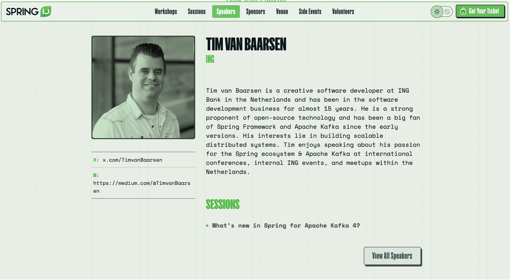

# Spring I/O Barcelona 2026 What's new in Spring Kafka 4

Demo codebase for my talk ["What's new in Spring for Apache Kafka 4"](https://2026.springio.net/sessions/whats-new-in-spring-for-apache-kafka-4/) at [Spring I/O 2026](https://2026.springio.net/) in Barcelona 

> You are a Spring Boot developer and using Kafka for your event-driven or streaming applications. Then you’ve probably chosen Spring for Apache Kafka as your go-to integration.
>
> With the release of Spring Boot 4, Spring for Apache Kafka has received a major upgrade! This new version fully embraces the Apache Kafka 4.x client and KRaft mode, eliminating ZooKeeper. But wait there is more!
> 
> In this practical deep-dive session, Tim will show you how to leverage the latest features in Spring for Apache Kafka 4, including:
>
> * Kafka Queues with shared consumers , enabling concurrent message processing from the same partition.
> * The new consumer rebalance protocol for faster and more efficient rebalances in your Kafka applications.
> * A practical migration path to guide you through breaking changes and test framework enhancements.
> 
> Live demos will show these features in action, so you can immediately apply them in your own projects.
> 
> Join this session and embrace the future of event streaming with Spring Boot 4 and Spring for Apache Kafka 4!




## Requirements

- **Docker & Docker Compose**: Version 24.0+
    - Required for running Kafka 4.2 (KRaft) & Schema Registry

- **Java**: 25 (LTS)
    - [Install via SDKMAN](https://sdkman.io/): `sdk install java 25-tem`
    - Or download from [Eclipse Temurin](https://adoptium.net/)

- **Maven**: 3.9.0+
    - Included via Maven Wrapper (`./mvnw`) in the project
    - Or install standalone from [Apache Maven](https://maven.apache.org/)

## Demos

* Demo 1: [A practical migration path to Spring Boot 4 and Spring Kafka 4](demo-1.md)
* Demo 2: [KIP-932: Queues for Kafka (Share Consumers)](demo-2.md)
* Demo 3: [KIP-933: New Consumer Rebalance Protocol](demo-3.md)

## Build and Run

```bash
./mvnw clean install
```

```bash
docker compose up -d
```
